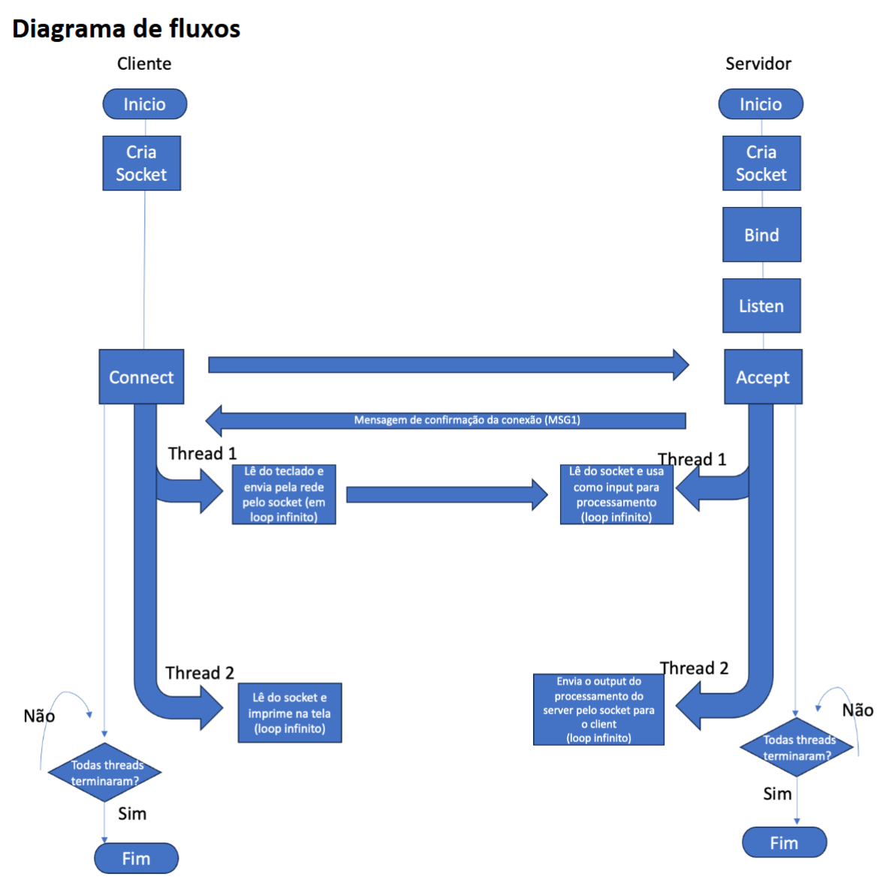

# 🎲 Loteria-Redes

**Cliente/servidor de loteria sobre TCP**, com comunicação bidirecional assíncrona por threads.


Projeto prático 1 da disciplina de **Redes de Computadores** — PUC.

---

## Sobre

O usuário conecta ao servidor, configura os parâmetros do sorteio e registra suas apostas.
A cada **1 minuto** o servidor sorteia os números, confere as apostas do ciclo, informa quantos
o jogador acertou e zera a lista para a próxima rodada.

O objetivo do trabalho é exercitar, na prática:

- **Sockets** — comunicação em rede no modelo cliente/servidor
- **Threads** — comunicação bidirecional assíncrona, sem um lado bloquear o outro
- **Memória compartilhada** — estruturas acessadas por duas threads ao mesmo tempo, com
  sincronização por mutex

## Como funciona

Cada lado roda **duas threads** sobre a mesma conexão: uma cuida do envio, outra da recepção.
É isso que permite ao usuário continuar digitando apostas enquanto o resultado de um sorteio
chega na tela.

```
         CLIENTE                                       SERVIDOR
   ┌──────────────────┐                        ┌──────────────────────┐
   │ thread 1         │ ──── ":qtd 6" ─────▶   │ thread 1             │
   │ lê o teclado     │ ──── "7 13 42" ────▶   │ recebe, valida e     │
   │ e envia          │                        │ registra na Lottery  │
   ├──────────────────┤                        ├──────────────────────┤
   │ thread 2         │ ◀── "SORTEIO: ..." ─── │ thread 2             │
   │ recebe e         │ ◀── "ACERTOU 2: ..." ──│ sorteia a cada       │
   │ imprime          │                        │ 1 minuto             │
   └──────────────────┘                        └──────────────────────┘
```

Cada cliente conectado tem a **sua própria loteria**: configuração, apostas e sorteio são
independentes. Um jogador não vê nem afeta a partida do outro.



## Protocolo

Texto puro sobre TCP, **uma mensagem por linha**, delimitada por `\n`.

O cliente não interpreta nada: ele apenas repassa o que foi digitado, e o servidor decide se
aquilo é comando ou aposta. Linhas iniciadas por `:` são comandos; o resto é aposta.

| Entrada | Efeito |
|---|---|
| `:inicio N` | define o menor número sorteável |
| `:fim N` | define o maior número sorteável |
| `:qtd N` | define quantos números saem por sorteio |
| `7 13 42` | registra uma aposta |

Sem nenhuma configuração, o padrão é **0 a 100, 5 números sorteados**. A configuração pode ser
alterada a qualquer momento e vale para o sorteio seguinte.

**Exemplo de sessão:**

```
14:32:07: CONECTADO!!
> :inicio 1
OK
> :fim 60
OK
> :qtd 6
OK
> 4 8 15 16 23 42
APOSTA REGISTRADA

SORTEIO: 8 15 21 33 42 55
APOSTA 1: 4 8 15 16 23 42 -> ACERTOU 3: 8 15 42
```

Uma aposta é recusada se estiver vazia, tiver números repetidos, tiver mais números do que
serão sorteados, ou contiver valor fora do intervalo configurado.

## Estrutura

```
src/
├── common/            código compartilhado pelos dois lados
│   ├── Socket         wrapper RAII sobre o Winsock (move-only)
│   ├── WinsockGuard   RAII do WSAStartup/WSACleanup
│   └── Protocol       parser dos comandos e das apostas
├── client/
│   ├── Client         conecta e roda as duas threads do cliente
│   └── main.cpp
└── server/
    ├── Server         accept loop: uma thread por cliente
    ├── ClientSession  ponte socket ↔ Lottery, e o timer do sorteio
    ├── Lottery        estado e regras do sorteio (sem rede, sem threads)
    └── main.cpp

docs/
├── Descrição-Projeto.txt   enunciado do trabalho
├── Diagrama-de-fluxos.png
└── Estudos.md              anotações de estudo do grupo
```

A classe `Lottery` é **autossincronizada**: todo método público tranca o próprio mutex, então
quem a usa não precisa travar nada por fora. O `draw()` sorteia, confere e zera a lista sob um
único lock — se o mutex fosse solto no meio, uma aposta que chegasse nesse intervalo seria
apagada sem nunca ter sido conferida.

## Compilando

**Requisitos:** [MSYS2](https://www.msys2.org/) com a toolchain UCRT64 (g++ 13+).

```bash
pacman -S mingw-w64-ucrt-x86_64-gcc
```

Com `C:\msys64\ucrt64\bin` no PATH, a partir da raiz do repositório:

```bash
g++ -std=c++20 -Wall -Wextra src/server/*.cpp src/common/*.cpp -o server.exe -lws2_32
```

```bash
g++ -std=c++20 -Wall -Wextra src/client/*.cpp src/common/*.cpp -o client.exe -lws2_32
```

O `-lws2_32` é obrigatório: é a biblioteca do Winsock.

**Executando** — servidor primeiro, cliente depois, em terminais separados:

```bash
./server.exe
```

```bash
./client.exe
```

Ambos aceitam argumentos opcionais e usam a porta **54000** por padrão. O servidor recebe ainda
um segundo argumento, o limite de clientes simultâneos, que vale **20** se não for informado:

```bash
./server.exe 54000 20
```

```bash
./client.exe 127.0.0.1 54000
```

O cliente que chega depois de o limite ter sido atingido recebe
`ERRO: LIMITE DE CLIENTES ATINGIDO` no lugar do `<HORARIO>: CONECTADO!!` e tem a conexão
encerrada. A vaga volta a ficar livre assim que qualquer sessão termina.

## Testes

O projeto tem duas baterias de teste, em `tests/`:

| | O que cobre | Duração |
|---|---|---|
| **unidade** (`test_lottery.cpp`) | as regras do sorteio isoladas — validação de configuração e de apostas, conferência de acertos, limpeza do ciclo, formatação, e duas threads mexendo na mesma `Lottery` | instantâneo |
| **integração** (`test_integration.cpp`) | sobe o `server.exe` de verdade e conversa com ele por TCP: MSG1, todos os comandos, apostas válidas e inválidas, loterias independentes entre dois clientes, um sorteio real e reconexão após desconectar | ~65 s |

```bash
make test        # só os de unidade (rápido)
```

```bash
make test-e2e    # só a integração
```

```bash
make test-all    # os dois
```

O teste de integração não usa mock: ele executa o mesmo binário que seria entregue, num
processo separado, e valida o que chega pela rede. É por isso que ele demora — espera o ciclo
real de 1 minuto para conferir o sorteio.

## Estado atual

| Componente | Estado |
|---|---|
| `Socket`, `WinsockGuard`, `Protocol` | ✅ |
| `Client` + `client/main.cpp` | ✅ |
| `Lottery` | ✅ |
| `Server` + `server/main.cpp` | ✅ |
| `ClientSession` | ✅ |

**O projeto está completo e funcional.** Cliente e servidor compilam sem nenhum warning sob
`-Wall -Wextra`, e a bateria de testes passa inteira — incluindo um teste de integração que
sobe o servidor de verdade, conecta dois clientes e acompanha um ciclo real de sorteio.

## Autores

- [Lucas Kitsuta Sabino](https://github.com/LkS-305)
- [Tiago Rodrigues](https://github.com/tiago-rods)
- [Artur Contarelli](https://github.com/arturcontarelli)

## Referência

Tanenbaum, A. S. **Computer Networks**, 4ª ed.
